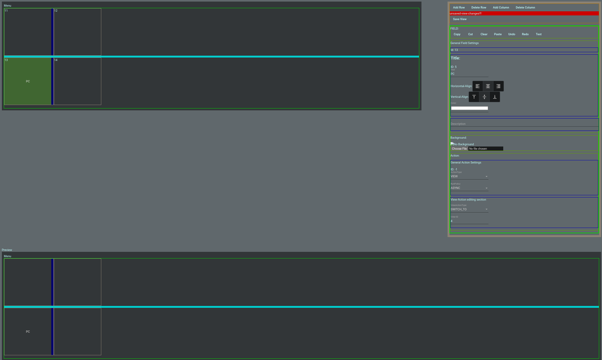

# Creating your first View

<figure markdown>
  { loading=lazy }
  <figcaption>Here you can see a list of all the existing Views created.</figcaption>
</figure>

From here there are two options:

1. "View": open in display / action mode: this is what is opened on the client (f.e. phone)
2. "Edit": open an editor for the view

!!! Danger

    creating a new view currently requires manual database insert. see: [allow creation of new view](https://gitlab.fischerserver.eu/controlpage/controlpage-frontend/-/issues/21)

    Example:
    ```sql
    INSERT INTO `view` (`name`, `group_id`) VALUES ('Lights', NULL);
    ```

## "View" mode

<figure markdown>
  { loading=lazy }
  <figcaption>Display the view and execute actions by clicking (instended to be run on client like phone, ...)</figcaption>
</figure>

## "Edit" mode

<figure markdown>
  { loading=lazy }
  <figcaption>Opening the view editor on a new view should look something like this.</figcaption>
</figure>

Clicking on a field in the edit section (top) allows configuring different properties for the field:

- Content like: text (including color/alignment), background, ...
- Action: configure what should happen when this field is pressed. More details here: [Features](features.md#actions)
- ...

At the button you can see a preview how it will look like in [View-Mode](#view-mode).

<figure markdown>
  { loading=lazy }
  { loading=lazy style="display: none;"}
  <figcaption>Basic example of configuring a field to switch to another view on click.</figcaption>
</figure>

!!! Bug

    There is currently an issue breaking creation of new row / column if the view is completly empty (no row and column exists). See: [Issue](https://gitlab.fischerserver.eu/controlpage/controlpage-frontend/-/issues/22).

    Workaround:
    ```sql
    INSERT INTO `field` (`colspan`, `description`, `rowspan`, `title`, `x_pos`, `y_pos`, `action_id`, `background_id`, `view_id`, `title_id`) VALUES ('1', NULL, '1', NULL, '0', '0', NULL, NULL, '5', NULL);
    ```

!!! Info

    This part of the docs is still WIP.
