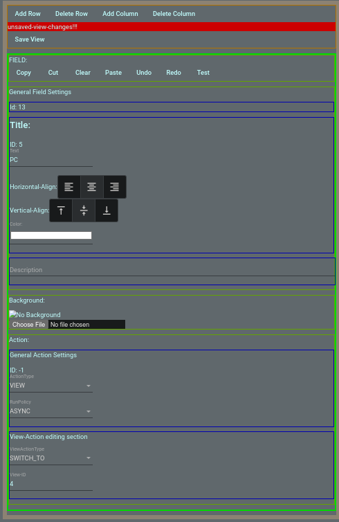

# Features

## Customization: highly customizable views / fields {#customization data-toc-label='Customization'}

<figure markdown>
  { loading=lazy }
  <figcaption>Field configuration options</figcaption>
</figure>

For each field it's possible to configure:

  - a background image
  - overlaying text (including color and alignment)
  - description: internal reference, only shown in this editor (for now)
  - ... (a lot more to come)

## Actions

There are only (intentionally! See: [FAQ](../faq.md)) a few types of actions supported:

  - switch to another view:
      - just "CLOSE" it and go back to the view-list
      - switch to a specific one
      - go back to the previous (f.e. when using one view as a "folder" to go back to the main one)
  - REST call: sending a GET or POST request to a specified URL and body
  - NodeCG(-IO) integration see: [NodeCG(-IO) Integration](nodecg-integration.md)

Furthermore, there is the option to either run synchronously or asynchronously. (more relevant in the future)

!!! Info

    This part of the docs is still WIP.
