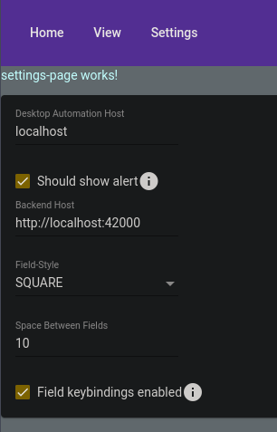

# Settings

Some global settings used by this client. Like the IP+Port the backend is reachable, ....

<figure markdown>
  { loading=lazy }
  <figcaption>Basic settings example.</figcaption>
</figure>

!!! Note

    These are stored locally on each client (browser cache), so need to be configured on each of them. But therefore also allows different settings on each device.

!!! Info

    This part of the docs is still WIP.
