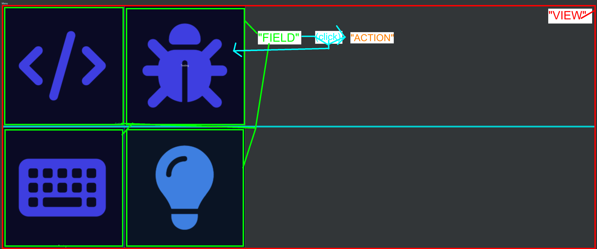

# Terminology

Terminology used in this project / repositories / this doc, .... Here is a first quick and dirty draft of the most common:

<figure markdown>
  { loading=lazy }
  <figcaption>Simple draft showing relationship between view, field and action. The whole thing is the "view". A view contains a 2-dimensional grid of "fields" (buttons that can be press to run):  "Actions". Something that happens after click: change current view, send http-request, ...</figcaption>
</figure>

!!! Info

    This part of the docs is still WIP.
