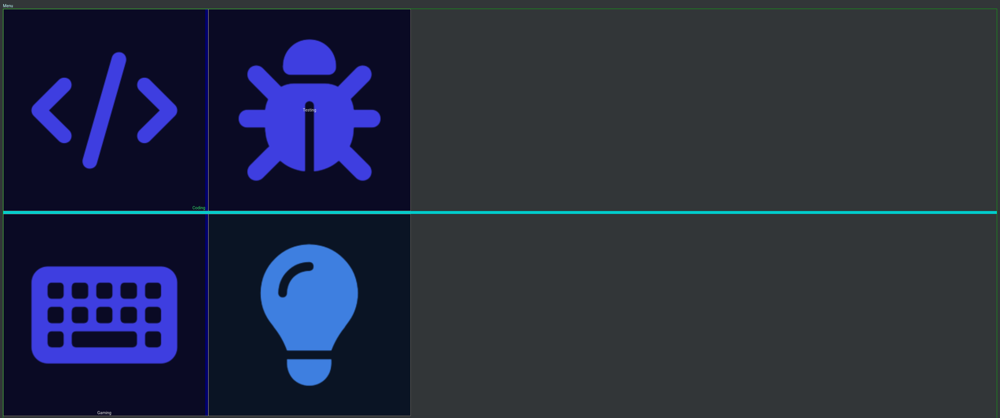

# ControlPage

ControlPage is a __Software__ Macro solution to efficiently control your applications.

<figure markdown>
  { loading=lazy }
  { loading=lazy style="display: none;"}
  <figcaption>ControlPage in Action (click for fullscreen)</figcaption>
</figure>

## Introduction

If you know any macro pad like the Elgato Stream Deck, FreeDeck, Touch Portal, .... You already know the goal of this project. But why create yet another one? See the [FAQ](faq.md).

## Getting Started

Continue here: [Installation](getting-started/installation.md).

To get an overview of the project: features including screenshots, ... see: [Features](getting-started/features.md).

To get a peak at planned features see the [Roadmap](contribute/roadmap.md).
